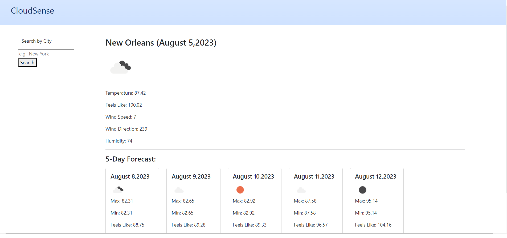

# <Weather App>

## Description

Provide a short description explaining the what, why, and how of your project. Use the following questions as a guide:

I was looking for a simple, clean weather forecast webpage that could hold my local city weather as well as a few cities that I would like to track for the purpose of travel. I wanted an interface that was clean and easy to read so that I could get at-a-glance weather information. 

This project uses the OpenWeather API to grab real-time weather data as well as a five day forecast for that location. This was my first time integrating a public API into a page, and I had the chance to explore what information was availble through the API, and that helped influence which information would be most helpful in my app. This has also convinced me to start looking at other public APIs to inspire future projects.

## Installation

N/A

## Usage

To get weather for a particular city, enter the name in the search bar on the left hand column. This will show you the current weather as well as a five day forecast on the center of the page. This will add the city name to the left column below the search bar, and if you need to access the current weather in that location again you can simply click on the city name and the page will update with the new information presented.

https://brian-wastle.github.io/Weather-App/

## Credits

OpenWeather API - https://openweathermap.org/
